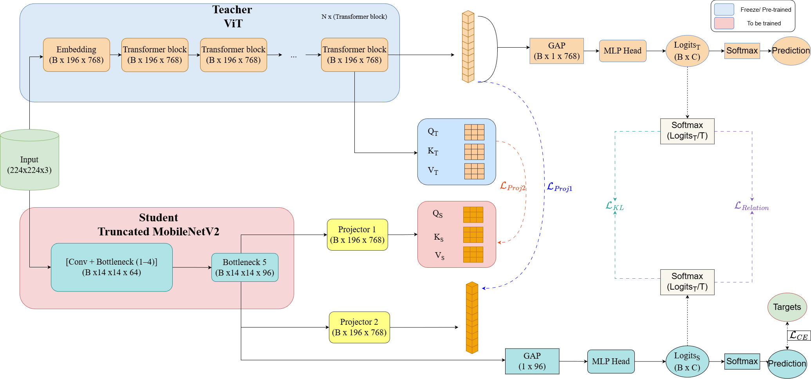

# AgriKD: Cross-Architecture Knowledge Distillation for Efficient Leaf Disease Classification

> Official implementation of the paper **"AgriKD: Cross-Architecture Knowledge Distillation for Efficient Leaf Disease Classification"**

---

## Baseline Model Selection

Before distillation, candidate teacher and student architectures were benchmarked on each dataset. That pipeline is available on a dedicated branch of this repository:

**[`baseline/teacher-student-selection`](../../tree/baseline/teacher-student-selection)** — benchmarks pretrained models (ViT, ResNet, MobileNet, EfficientNet, …) and exports F1/accuracy/AUC results to Excel.

The experiments there led to selecting **ViT-B/16 as the teacher** and **truncated MobileNetV2 (Bottleneck 1–5) as the student** for AgriKD.

---

## Overview

AgriKD adapts cross-architecture knowledge distillation (Liu et al., 2022) for agricultural leaf disease diagnosis. A large **ViT-B/16 teacher** transfers rich global attention knowledge to a lightweight **truncated MobileNetV2 student** via two trainable projectors, enabling high-accuracy inference at a fraction of the teacher's computational cost.

The student retains only Bottleneck stages 1–5 (output: 14 × 14 × 96), making it suitable for edge deployment while achieving competitive classification performance through five complementary supervision signals.

---

## Pipeline




The distillation framework comprises:

| Component | Role |
|---|---|
| **Teacher** ViT-B/16 | Frozen; provides QKV attention maps, CLS token features, and soft logits |
| **Student** Truncated MobileNetV2 | Trained end-to-end; Bottleneck 1–5, 14×14×96 output |
| **Projector 1** — PCAttentionProjector | Maps student features → teacher attention space (L_proj1) |
| **Projector 2** — GWLinearProjector | Maps student features → teacher feature space pixel-by-pixel (L_proj2) |
| **L_KL** | Hinton KD logits distillation at temperature T |
| **L_Rel** | DIST relational loss |
| **L_CE** | Cross-entropy with label smoothing |

---

## Loss Function

The total training objective is:

$$\mathcal{L} = \lambda_{CE}\,\mathcal{L}_{CE} + \lambda_{proj1}\,\mathcal{L}_{proj1} + \lambda_{proj2}\,\mathcal{L}_{proj2} + \lambda_{KL}\,\mathcal{L}_{KL} + \lambda_{Rel}\,\mathcal{L}_{Rel}$$

### Loss Weight Initialisation

Dataset-specific λ values are computed via a **heuristic single-loss evaluation** (§ Loss Weight Initialisation in the paper). Each loss component is trained in isolation on 70 % of the data and evaluated on a fixed 15 % held-out validation set (the 15 % test set is never touched). Contribution F1-scores are then normalised to produce the final λ coefficients.

Across all three evaluated datasets, **L_KL and L_Rel consistently receive the largest weights (λ ≈ 0.30–0.33)**, while the two projection losses receive auxiliary weights (λ ≈ 0.01–0.06).

To run the heuristic weight initialisation:

```python
# config.py
HEURISTIC_WEIGHT_INIT_MODE = True
```

Results are exported to `checkpoints/ablation_weight_summary.xlsx`.

---

## Repository Structure

```
Capstone_KD/
├── config.py                  # All hyperparameters — edit here
├── main.py                    # Training pipeline + heuristic weight init
├── dataset.py                 # DatasetHandler with stratified CV splits
├── Teacher_extraction.py      # ViT-B/16 feature & QKV extractor
├── Student_extraction.py      # Truncated MobileNetV2 backbone
├── PCA_projector.py           # Partially Cross-Attention Projector (Proj1)
├── GWLinear_projector.py      # Group-Wise Linear Projector (Proj2)
├── loss_functions.py          # ProjectionLoss, LogitsKDLoss, DIST, FocalLoss
├── visualization.py           # Training curve plots
├── compared_projectors.py     # Projector comparison utilities
└── requirements.txt
```

---

## Installation

```bash
pip install -r requirements.txt
```

**Key dependencies:** PyTorch ≥ 2.0, torchvision, timm, scikit-learn, openpyxl, pandas, matplotlib

---

## Reproducibility

### 1. Prepare the dataset

Organise images in `ImageFolder` format:

```
data/
└── ProcessedOriginal/
    ├── class_0/
    ├── class_1/
    └── ...
```

### 2. Configure

Edit `config.py`:

```python
DATA_DIR           = "/path/to/ProcessedOriginal"
TEACHER_CHECKPOINT = "/path/to/teacher.pth"
NUM_CLASSES        = 5          # adjust per dataset
RANDOM_SEED        = 42
```

### 3. (Optional) Heuristic Loss Weight Initialisation

```python
HEURISTIC_WEIGHT_INIT_MODE = True   # runs 5 single-loss experiments
```

```bash
python main.py
# Outputs: checkpoints/ablation_weight_summary.xlsx
```

Copy the resulting λ values into `config.py` and set `HEURISTIC_WEIGHT_INIT_MODE = False`.

### 4. Train (single split)

```python
USE_CROSS_VALIDATION = False
```

```bash
python main.py
```

### 5. Train (5-fold cross-validation)

```python
USE_CROSS_VALIDATION = True
CV_N_SPLITS          = 5
# For per-fold teacher checkpoints (imbalanced datasets):
# CV_TEACHER_CHECKPOINTS = ["/fold1.pth", ..., "/fold5.pth"]
```

```bash
python main.py
# Outputs: checkpoints/run_N/cv_summary_results.xlsx
```

---

## Results

> Detailed per-dataset results and λ weight tables are reported in the paper.

Key findings:
- L_KL and L_Rel dominate across all datasets (λ ≈ 0.30–0.33), confirming their role as primary distillation objectives.
- L_proj1 and L_proj2 act as auxiliary feature-alignment terms (λ ≈ 0.01–0.06).
- AgriKD achieves competitive F1 scores with a student model significantly smaller than the ViT-B/16 teacher.

---

## Configuration Reference

| Parameter | Default | Description |
|---|---|---|
| `TEACHER_CHECKPOINT` | — | Path to pre-trained ViT-B/16 weights |
| `EPOCHS` | 150 | Total training epochs |
| `LR_STUDENT` | 5e-3 | Initial student learning rate |
| `TEMPERATURE` | 4.0 | Hinton KD temperature |
| `LAMBDA_CE / PROJ1 / PROJ2 / LOGITS / DIST` | 1.0 | Loss weights λ₁…λ₅ |
| `USE_CROSS_VALIDATION` | False | Enable 5-fold stratified CV |
| `CV_TEACHER_CHECKPOINTS` | None | Per-fold teacher paths (imbalanced data) |
| `USE_WEIGHTED_SAMPLER` | False | Inverse-frequency weighted sampling |
| `USE_FOCAL_LOSS` | False | PolyFocalLoss instead of CE |
| `HEURISTIC_WEIGHT_INIT_MODE` | False | Run λ heuristic initialisation experiments |


